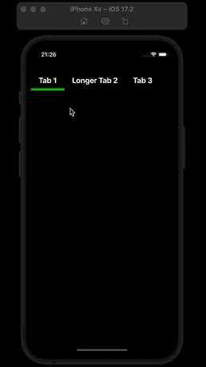

React Native — Flexible tabs with an underline animation that adjusts to the tabs' width. Uses onLayout to measure the widths of the tabs



# To run

```bash
# using npm
npm i && npx pod-install && npm run ios

# OR using Yarn
yarn && npx pod-install && yarn ios
```
